# Первое задание

<a>3(1,2) номер в методичке</a>

1) Размерность и базис линейного пространства

    - Векторное пространство V называется n-мерным, если в нем существует система из n линейно независимых векторов, а любая система из большего количества векторов линейно зависима. Число n называется размерностью векторного пространства V и обозначается dimV. <ins>Размерность линейного пространства</ins> - это максимальное число линейно независимых векторов этого пространства.

    -<ins>Базисом</ins> n-мерного векторного пространства называется упорядоченная совокупность n линейно независимых векторов(базисных векторов).

2) Алгебраическое и ортогональное дополнения

    - <ins>Ортогональным дополнением</ins> непустого подмножества M евклидова пространства E называется множество векторов, ортогональных каждому вектору из М.

    - Подпространство L^+ называется <ins>алгебраическим дополнением</ins> подпространства L <| V, если V = L "прямая сумма" L^+

# Второе задание

<a>6 номер в методичке </a>

1) Евклидово пространство

    - Вещественное векторное пространство E называется евклидовым, если каждой паре элементов u, v этого пространства поставлено в соответствие действительное число (u,v), называемое скалярным произведением, причем это соответствие удовлетворяет следующим условиям:
        
        - коммутативность

        - аддитивность по первому множителю

        - однородность по первому множителю

        - неотрицательность скалярного квадрата

2) Задача о перпендикуляре и ее решение(?)

    - Задача о перпендикуляре ставится следующим образом. В n-мерном евклидовом пространстве заданы вектор v принадлежащий E и подпространство L <| Е. Требуется найти ортогональную проекцию l принадлежащую L вектора v и его ортогональную составляющую(перпендикуляр) h принадлежащий L

    - Решение(хз нужно или нет):

        - Взять любой базис e ... er подпространства L(полагаем что dimL = r <= n)

        - Составить неоднородную систему 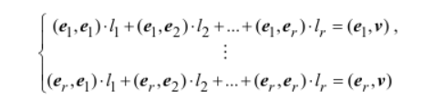 r уравнений с r неизвестными l1 ... lr

        - Решить систему из п.2

        - Найти ортогональную проекцию l = l1 * e1 + ... + lr * er, а затем ортогональную составляющую(перпендикуляр) h = v - l.

3) Ортогональные векторы

    - Два вектора u,v евклидова пространства называются ортогональными(перпендикулярными), если их скалярное произведение равно нулю: (u,v) = 0.

4) Ортогональный и ортонормированный базис.

    - Базис e1 ... en евклидова пространства называется ортогональным, если все образующие его векторы попарно ортогональны, т.е. 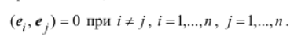

    - Базис e1 ... en евклидова пространства называется ортонормированным, если его векторы попарно ортогональны и длина каждого из них равна единице: 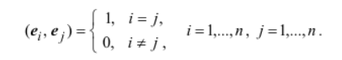

# Третье задание

<a>8,9 номер в методичке </a>

1) Линейные преобразования: матрица преобразования в стандартном базисе, ядро, образ, дефект, ранг преобразования.

    - Линейным преобразованием векторного пространства V называется линейное отображение 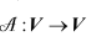 пространства V в себя.

    - Матрицей линейного преобразования 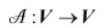 в базисе e1 ... en пространства V называется квадратная матрица А, составленная из координатных столбцов образов базисных векторов 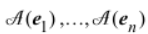, найденных относительно базиса е1 ... en.

    - Поскольку линейное преобразование является частным случаем линейного отображения, к нему применимы все понятия и свойства, рассмотренные для отображений: инъективность, сюръективность, биективность, обратимость, ядро, образ, дефект, ранг и т.д.

    - 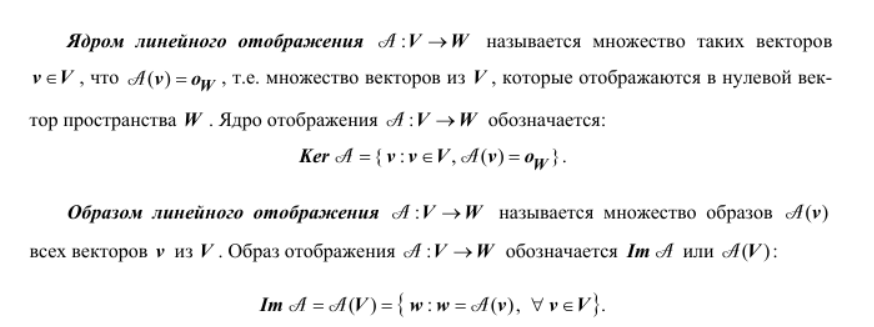

    - 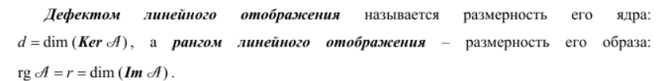

2) Свойства инъективности, сюръективности, обратимости:
    
    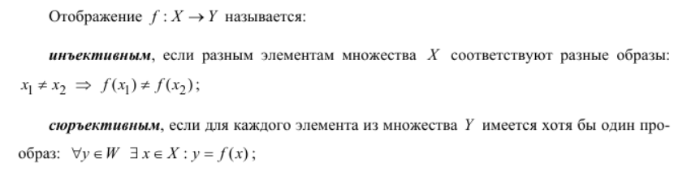

    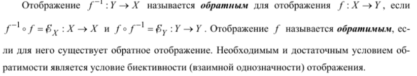

3) Собственные векторы и значения преобразования

    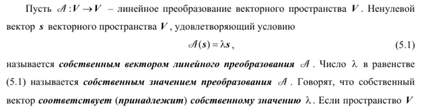

